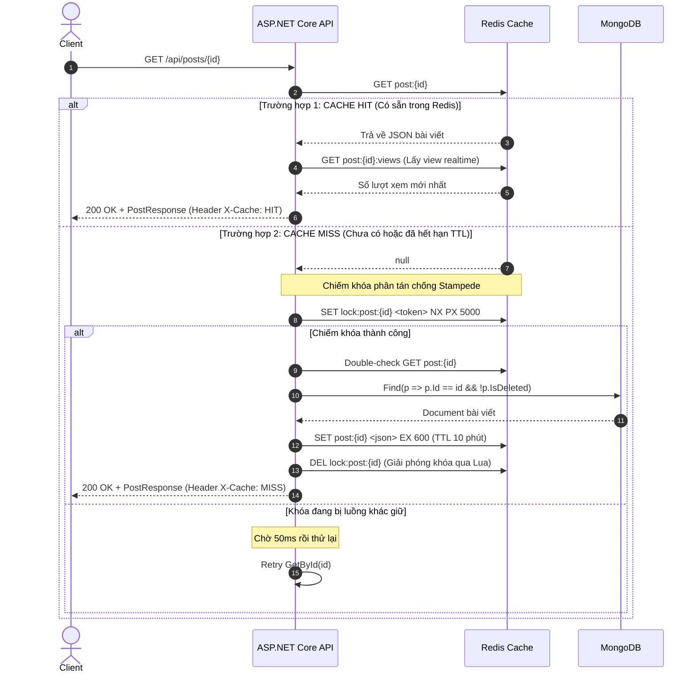

# Báo Cáo Chuyên Đề: Nguyên Lý Cache-Aside Pattern & Phân Hệ Caching Redis

**Học phần**: Hệ Cơ Sở Dữ Liệu NoSQL  
**Đề tài 06**: Phân hệ caching bài viết và quản lý phiên (Redis + MongoDB)  
**Người thực hiện**: Nguyễn Anh Quan (SV2 — Advanced Query Specialist)  
**Mã Task Jira**: SCRUM-28  

---

## 1. Đặt Vấn Đề & Khái Niệm Cache-Aside Pattern

Trong các hệ thống tin tức điện tử và ứng dụng web có lưu lượng đọc dữ liệu áp đảo (Read-Heavy Systems), cơ sở dữ liệu gốc (trong đề tài này là MongoDB) thường xuyên phải đối mặt với nguy cơ quá tải I/O đĩa và CPU khi phục vụ hàng nghìn lượt truy vấn chi tiết bài viết mỗi giây.

**Cache-Aside Pattern** (còn được gọi là **Lazy Loading** hoặc **Phụ tải theo yêu cầu**) là mô hình kiến trúc caching trong đó:
- Ứng dụng (Application Server) trực tiếp tương tác và điều phối luồng dữ liệu giữa tầng Cache (Redis) và Cơ sở dữ liệu gốc (MongoDB).
- Dữ liệu chỉ được nạp vào cache khi có request thực tế yêu cầu đọc (On-Demand), thay vì nạp đồng loạt trước.
- Tầng cache không tương tác trực tiếp với cơ sở dữ liệu; toàn bộ logic kiểm tra, nạp bù và vô hiệu hóa do mã nguồn ứng dụng quản lý.

---

## 2. So Sánh Với Các Chiến Lược Caching Khác

| Chiến Lược | Cơ Chế Hoạt Động | Ưu Điểm | Nhược Điểm | Ứng Dụng Trong Đề Tài |
|---|---|---|---|---|
| **Cache-Aside (Lazy Loading)** | Ứng dụng kiểm tra Cache -> Miss -> đọc DB -> ghi Cache | Chỉ cache dữ liệu được yêu cầu; tiết kiệm RAM; chịu lỗi tốt nếu Cache sự cố | Lần đọc đầu tiên bị trễ (Cold Start); rủi ro Cache Stampede | **Chi tiết bài viết (`GET /api/posts/{id}`)** |
| **Write-Through** | Ghi vào Cache và DB đồng thời trong cùng transaction | Cache luôn mới nhất, không bị Cold Start | Độ trễ ghi cao vì phải đợi cả 2 hệ thống phản hồi | Không dùng cho bài viết |
| **Write-Behind (Write-Back)** | Ghi vào Cache ngay -> Background Worker định kỳ flush về DB | Tốc độ ghi cực nhanh, giảm tải tuyệt đối cho DB | Rủi ro mất dữ liệu nếu Cache sập trước khi kịp flush | **Bộ đếm lượt xem (`INCR post:{id}:views`)** |
| **Refresh-Ahead** | Tự động dự đoán và nạp lại cache trước khi TTL hết hạn | Giảm thiểu Cache Miss | Phức tạp trong việc dự đoán hành vi người dùng | Không dùng |

---

## 3. Sơ Đồ Kiến Trúc & Quy Trình Hoạt Động Chuẩn

### 3.1. Sơ đồ tuần tự (Sequence Diagram) — Luồng đọc Cache-Aside

---

## 4. Các Thách Thức Kỹ Thuật Chuyên Sâu & Giải Pháp Triển Khai

### 4.1. Bài toán Cache Stampede (Dog-piling) & Khóa Phân Tán
- **Hiện tượng**: Khi một bài viết tin tức "hot" vừa hết hạn TTL (sau 10 phút), hàng trăm request ập đến cùng 1 mili-giây. Tất cả đều thấy Cache MISS và đồng loạt gửi query đến MongoDB. Hiện tượng này làm tăng đột biến CPU/RAM MongoDB, dẫn đến sập hệ thống (Cascading Failure).
- **Giải pháp áp dụng**: Sử dụng cơ chế **Distributed Lock** với Redis command `SET lock:post:{id} <token> NX PX 5000` (được đóng gói qua `IDatabase.LockTakeAsync` và `LockReleaseAsync`):
  1. Chỉ duy nhất request đầu tiên lấy được lock và được quyền truy vấn MongoDB.
  2. Các request còn lại bị từ chối lock sẽ `Task.Delay(50)` và đọc lại cache (lúc này đã được nạp bởi request đầu tiên).
  3. Giải phóng lock bắt buộc kiểm tra token bằng **Lua Script atomic** để tránh trường hợp luồng A chạy quá lâu làm hết hạn lock, sau đó xóa nhầm lock của luồng B.

### 4.2. Bài toán Tính Nhất Quán Dữ Liệu (Cache Consistency)
- **Quy tắc bất di bất dịch**: **GHI MONGODB TRƯỚC, XÓA/VÔ HIỆU HÓA REDIS SAU**.
- **Phân tích nguy cơ nếu xóa Cache trước**:
  1. Luồng Ghi xóa cache `DEL post:{id}`.
  2. Một Luồng Đọc chen vào giữa: thấy Cache Miss, đọc dữ liệu CŨ từ MongoDB nạp ngược lại vào Redis.
  3. Luồng Ghi hoàn tất cập nhật dữ liệu MỚI vào MongoDB.
  4. **Hậu quả**: Redis tiếp tục lưu dữ liệu cũ thêm trọn vẹn 10 phút TTL, dữ liệu giữa Cache và DB bị phân kỳ (Inconsistent).
- **Thực thi trong đề tài**: Trong `PostsController.Update` và `Delete`, MongoDB được `FindOneAndUpdateAsync`/`UpdateOneAsync` xong trước, sau đó mới thực thi `_cacheService.RemoveAsync(CacheKey(id))`.

### 4.3. Bài toán Vô Hiệu Hóa Cache Danh Sách O(1) (Cache Key Versioning)
- **Vấn đề**: Danh sách bài viết trên trang chủ và chuyên mục có nhiều trang (`posts:cat:{id}:p1`, `p2`, `p3`...). Khi có bài viết mới hoặc sửa/xóa, nếu dùng lệnh `SCAN` tìm mọi key `posts:cat:*` để `DEL` thì độ phức tạp là $O(N)$, làm nghẽn Event Loop đơn luồng của Redis.
- **Giải pháp**: Áp dụng **Cache Versioning**:
  - Dựng key danh sách: `posts:cat:{id}:p{page}:v{ver}` với `ver` đọc từ key `posts:ver`.
  - Khi có biến động dữ liệu: Thực thi một lệnh atomic duy nhất: `INCR posts:ver` ($O(1)$).
  - Ngay lập tức, mọi key danh sách phiên bản cũ mang số nhỏ hơn sẽ không bao giờ được tra cứu nữa và tự động bị giải phóng bộ nhớ khi hết hạn TTL ngắn (3 phút).

### 4.4. Bộ Đếm Realtime Lượt Xem (Realtime INCR + Write-Behind Worker)
- **Vấn đề**: Nếu mỗi lượt đọc bài viết đều thực hiện `UPDATE posts SET views = views + 1` trên MongoDB thì MongoDB sẽ bị nghẽn ghi I/O.
- **Giải pháp**:
  - Khi xem bài: Thực thi atomic `INCR post:{id}:views` trên Redis (tốc độ nano-giây trong RAM, không có TTL).
  - Tách luồng đồng bộ: Đánh dấu ID vào Redis Set `posts:dirty_views`.
  - `ViewCountSyncWorker` chạy ngầm định kỳ 1 phút quét các ID dirty và cập nhật hàng loạt về MongoDB theo mô hình Write-Behind.

---

## 5. Kết Luận & Kết Quả Thực Nghiệm Demo

Hệ thống đã triển khai đầy đủ các pattern trên và đạt được kết quả:
1. **Thời gian phản hồi**:
   - Lần 1 (Cache MISS — MongoDB Query + Lock): ~80ms - 200ms. Header trả về: `X-Cache: MISS`.
   - Lần 2 (Cache HIT — Redis In-Memory): < 3ms - 5ms. Header trả về: `X-Cache: HIT`.
2. **Độ an toàn**:
   - Không bị rò rỉ lock nhờ TTL 5 giây tự động giải phóng.
   - Thống kê tỷ lệ Hit Rate minh bạch qua endpoint `GET /api/cache/stats`.
