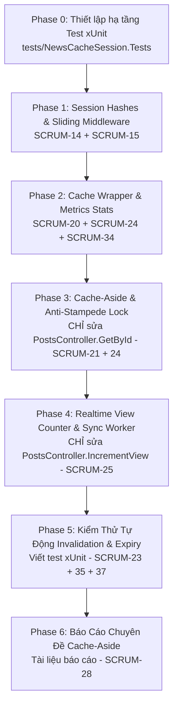

# Kế Hoạch TDD: Phân Hệ Redis Caching & Quản Lý Phiên (SV2)

> ⛔ **NGUYÊN TẮC BẤT DI BẤT DỊCH: TUYỆT ĐỐI KHÔNG ĐỤNG VÀO FILE/TASK CỦA THÀNH VIÊN KHÁC**
> - **KHÔNG ĐỤNG VÀO FILE CỦA SV1 (Hồ Ngọc Phương Như)**:
>   - `Models/*`, `DTOs/*`, `Utils/SlugHelper.cs`, `Data/MongoIndexInitializer.cs`
>   - `Controllers/AuthController.cs`, `Controllers/CategoriesController.cs`
>   - `Controllers/PostsController.cs` (CÁC METHOD: `GetAll`, `GetBySlug`, `Create`, `Update`, `Delete`)
>   - `Services/ICurrentUserService.cs`, `Services/CurrentUserService.cs`
>   - `Services/ISessionQueryService.cs`, `Services/RedisSessionQueryService.cs`
> - **KHÔNG ĐỤNG VÀO FILE CỦA SV3 (Nguyễn Xuân Định)**:
>   - `src/frontend/**`
>   - `scripts/SeedPosts/seed.py`
>   - `scripts/Benchmark/benchmark.py`

---

## 1. 📂 Danh Sách File SV2 Được Phép Chỉnh Sửa & Sở Hữu

Chỉ thực hiện trong các file sau:
1. `src/NewsCacheSession.Api/Services/ISessionService.cs` (SV2)
2. `src/NewsCacheSession.Api/Services/RedisSessionService.cs` (SV2)
3. `src/NewsCacheSession.Api/Middleware/SessionAuthMiddleware.cs` (SV2)
4. `src/NewsCacheSession.Api/Services/ICacheService.cs` (SV2)
5. `src/NewsCacheSession.Api/Services/RedisCacheService.cs` (SV2)
6. `src/NewsCacheSession.Api/Controllers/PostsController.cs` → **CHỈ DUY NHẤT 2 METHOD**:
   - `[HttpGet("{id}")] public async Task<IActionResult> GetById(string id)`
   - `[HttpPost("{id}/view")] public async Task<IActionResult> IncrementView(string id)`
7. `src/NewsCacheSession.Api/Services/ViewCountSyncWorker.cs` (Tạo mới worker nền của SV2 cho `IncrementView`)
8. `src/NewsCacheSession.Api/Controllers/CacheStatsController.cs` (Tạo mới endpoint thống kê của SV2 cho SCRUM-34)
9. `src/NewsCacheSession.Api/appsettings.json` (Chỉ thêm `SessionSettings` - phân công SV2 trong AGENTS.md mục 6)
10. `tests/NewsCacheSession.Tests/**` (Tạo mới project test xUnit phục vụ TDD)

---

## 2. 🗺️ Lộ Trình 7 Phase Thực Thi Của Riêng SV2

### Danh Sách Chi Tiết Từng Phase:

- [x] **[Phase 0: TDD Test Infrastructure Setup](phase-00-test-infrastructure-setup.md)** - `Completed`
- [x] **[Phase 1: Session Management & Authentication Pipeline](phase-01-session-management-redis-hashes.md)** (SCRUM-14, SCRUM-15) - `Completed`
- [x] **[Phase 2: Cache Service Wrapper & Metrics](phase-02-cache-client-and-metrics.md)** (SCRUM-20, SCRUM-24, SCRUM-34) - `Completed`
- [x] **[Phase 3: Cache-Aside Engine & Anti-Stampede Lock](phase-03-cache-aside-stampede-lock.md)** (SCRUM-21, SCRUM-24) - `Completed`
- [x] **[Phase 4: Realtime View Counter & Background Sync Worker](phase-04-realtime-view-counter.md)** (SCRUM-25) - `Completed`
- [x] **[Phase 5: Automated Invalidation & Expiry Test Suite](phase-05-cache-invalidation-and-testing.md)** (SCRUM-23, SCRUM-35, SCRUM-37) - `Completed`
- [x] **[Phase 6: Báo Cáo Chuyên Đề Cache-Aside](phase-06-tai-lieu-bao-cao-cache-aside.md)** (SCRUM-28) - `Completed`
